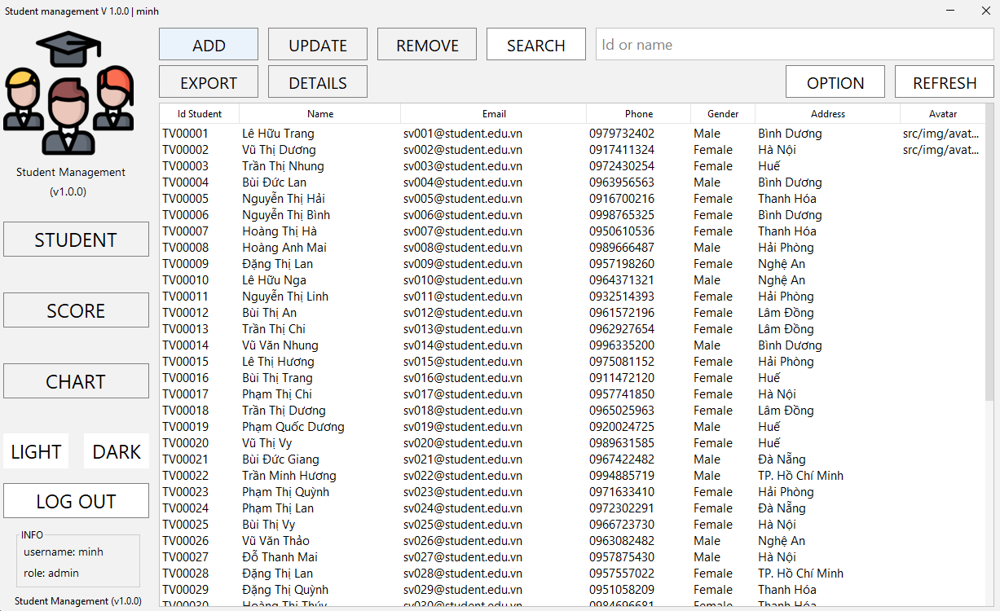
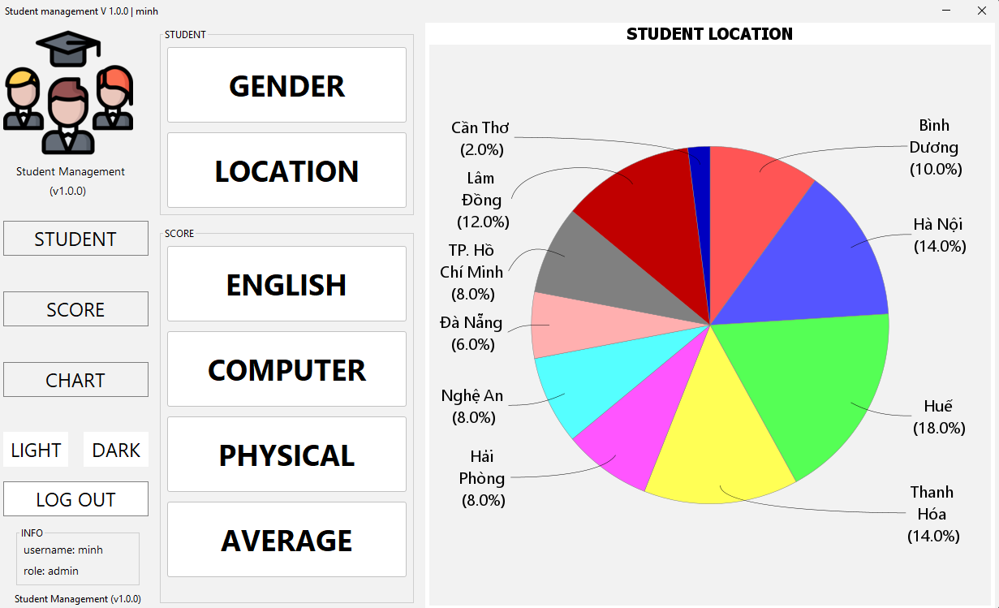
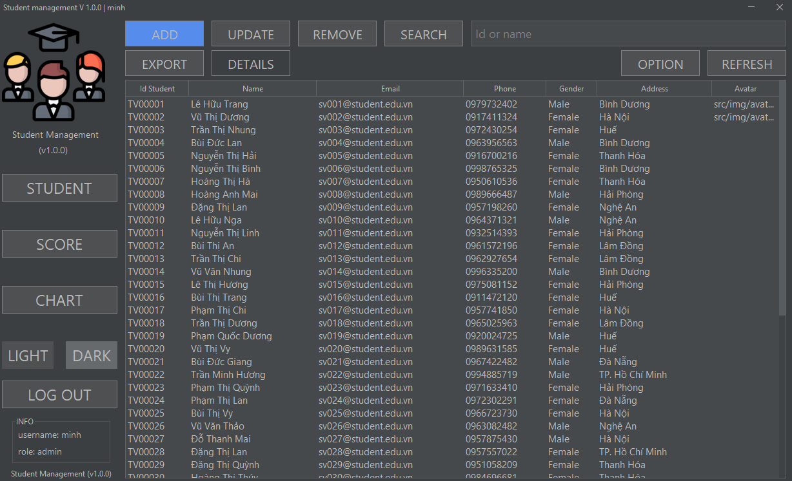
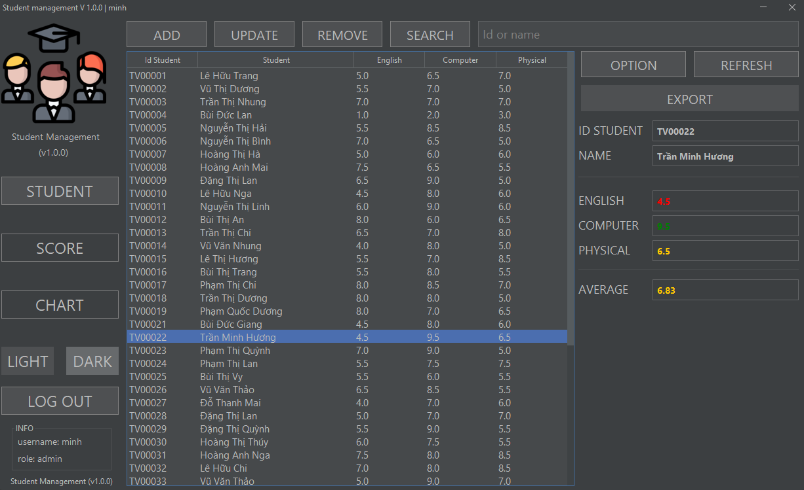
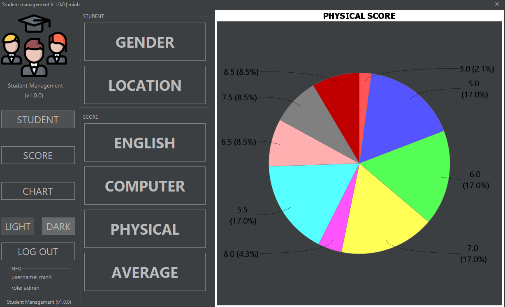

# 🎓 Student Management & Score System

- Username: minh
- Password: 123
  
## Light Mode 





## Dark Mode





## 📋 Overview

A modern Java Swing desktop application for comprehensive student management and academic performance tracking. Built with clean architecture principles, this system connects to SQL Server via JDBC and provides an intuitive interface for managing student records, tracking performance metrics, generating statistical reports, and visualizing data through interactive charts.

The application features secure authentication, real-time data validation, and efficient data export capabilities - making it ideal for educational institutions seeking a robust management solution.

## ✨ Key Features

### 🔐 User Authentication
- Secure login and registration with jBCrypt password encryption
- Role-based access control with multi-user support

### 👨‍🎓 Student Management
- Complete CRUD operations with intuitive interfaces
- Advanced search with multiple filtering options
- Auto-generated student IDs with database counters
- Dedicated screens for profile management

### 📊 Score Tracking
- Comprehensive grade management across multiple subjects
- Automatic average calculation with validation
- Historical performance trending
- Specialized interfaces for grade operations

### 📈 Analytics Dashboard
- Demographic breakdowns with interactive visualizations
- Subject performance distribution charts
- JFreeChart-powered data visualization
- Top performers tracking and identification

### 💾 Data Operations
- One-click CSV export functionality
- Customizable reporting templates

## 🛠️ Technology Stack

- **Core**: Java 11+
- **UI**: Java Swing with FlatLaf for modern styling
- **Database**: SQL Server with JDBC connectivity
- **Security**: jBCrypt for password hashing
- **Visualization**: JFreeChart for interactive charts
- **Build**: Maven/Gradle compatible structure

## 📁 Project Structure

```
project-root/
├── src/
│   ├── Connection/                 # Database connectivity
│   │   ├── Connection_SQL_Server.java
│   │   └── Connection_ConnectorHelper.java
│   │
│   ├── DAO/                        # Data Access Objects
│   │   ├── DAO_Login.java
│   │   ├── DAO_Register.java
│   │   ├── DAO_Students.java
│   │   ├── DAO_Score.java
│   │   ├── DAO_Sort.java
│   │   └── DAO_Chart.java
│   │
│   ├── Model/                      # Data models
│   │   ├── Model_User.java
│   │   ├── Model_Students.java
│   │   └── Model_Score.java
│   │
│   ├── Service/                    # Business logic
│   │   ├── Handle_Exception.java
│   │   ├── Handle_Notification.java
│   │   ├── Service_Avatar.java
│   │   ├── Service_BCrypt.java
│   │   ├── Service_ExportHelper.java
│   │   ├── Service_Login.java
│   │   ├── Service_Register.java
│   │   ├── Service_Score.java
│   │   ├── Service_Sort.java
│   │   └── Service_Student.java
│   │
│   └── View/                       # UI components
│       ├── Screen/                 # Main screens
│       │   ├── View_Index.java
│       │   ├── View_Login.java
│       │   ├── View_Register.java
│       │   ├── View_Chart.java
│       │   ├── View_Score.java
│       │   └── View_Student.java
│       │ 
│       └── SubScreen/              # Modal/secondary screens
│           ├── Student/            # Student-related operations
│           │   ├── SubScreen_AddStudent.java
│           │   ├── SubScreen_DetailsStudent.java
│           │   └── SubScreen_UpdateStudent.java
│           │
│           └── Score/              # Score-related operations
│               ├── SubScreen_AddScore.java
│               ├── SubScreen_OptionScore.java
│               └── SubScreen_UpdateScore.java
│
├── scripts/                        # SQL scripts
│   ├── script_create_database.sql
│   └── script_insert_database.sql
│
└── README.md
```

## 🚀 Getting Started

### Prerequisites
- Java 11 or higher
- SQL Server instance
- IDE (IntelliJ IDEA, Eclipse, NetBeans) or Maven/Gradle

### Installation

1. **Clone the repository**
   ```bash
   git clone https://github.com/yourusername/student-management-system.git
   cd student-management-system
   ```

2. **Add required libraries**
   ```
   Required JAR files:
   - flatlaf-demo-3.5.4.jar
   - jbcrypt-0.4.jar
   - jfreechart-1.5.5.jar
   - mssql-jdbc-12.8.1.jre11.jar
   ```

3. **Configure database connection**
   - Update connection parameters in `Connection_SQL_Server.java`:
     - SQL_Url
     - SQL_Port
     - SQL_Database
     - SQL_User
     - SQL_Password
   
4. **Initialize database**
   ```bash
   # Using SSMS or sqlcmd, run the following scripts:
   ./scripts/script_create_database.sql
   ./scripts/script_insert_database.sql
   ```

## 📖 Usage Guide

### Getting Started
1. Launch the application from your IDE or command line
2. Log in with default credentials or register a new account
3. Navigate through the dashboard to access different modules

### Student Management
- Browse student records with powerful search functionality
- Add new students through the dedicated interface
- View detailed student profiles
- Update existing student information
- Use specific screens:
  - Add Student: Create new student records
  - Student Details: View comprehensive student information
  - Update Student: Modify existing student data

### Score Management
- View and search for student scores across subjects
- Add and update score records
- Use sorting options to analyze performance patterns
- Track top performers in various subjects
- Access specialized interfaces:
  - Add Score: Enter new grade data for students
  - Update Score: Modify existing grade information
  - Score Options: Sort and view top 10 performers

### Analytics & Reporting
- Access interactive visualizations for:
  - Gender and geographic distribution
  - Subject performance breakdowns (English, Computer, Physical)
  - Score averages and performance trends
- Export data to CSV for external analysis or sharing

### Data Export
- Utilize the CSV export functionality to save or share data
- Generate custom reports based on filtered data views

## 🤝 Contributing

We welcome contributions to improve this project! Here's how you can help:

1. Fork the repository
2. Create a feature branch (`git checkout -b feature/amazing-feature`)
3. Commit your changes (`git commit -m 'Add some amazing feature'`)
4. Push to the branch (`git push origin feature/amazing-feature`)
5. Open a Pull Request

Please ensure your code follows the existing style and includes appropriate tests.

## 📄 License

This project is licensed under the MIT License - see the LICENSE file for details.

## 👏 Acknowledgements

- [FlatLaf](https://www.formdev.com/flatlaf/) - Modern Look & Feel for Java Swing
- [jBCrypt](https://www.mindrot.org/projects/jBCrypt/) - Password hashing library
- [JFreeChart](http://www.jfree.org/jfreechart/) - Java chart library
- [Microsoft JDBC Driver for SQL Server](https://docs.microsoft.com/en-us/sql/connect/jdbc/microsoft-jdbc-driver-for-sql-server) - JDBC driver

---

## 📬 Contact

If you have any questions or feedback, please reach out:
- **Name**: [Nguyen Quang Minh](https://nguyenminh8.wordpress.com/)
- **Email**: nguyenminh1301.dev@gmail.com
- **GitHub**: [NguyenMinh1301](https://github.com/NguyenMinh1301)
